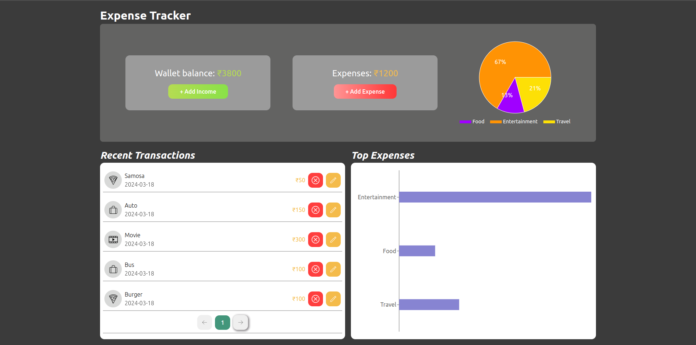
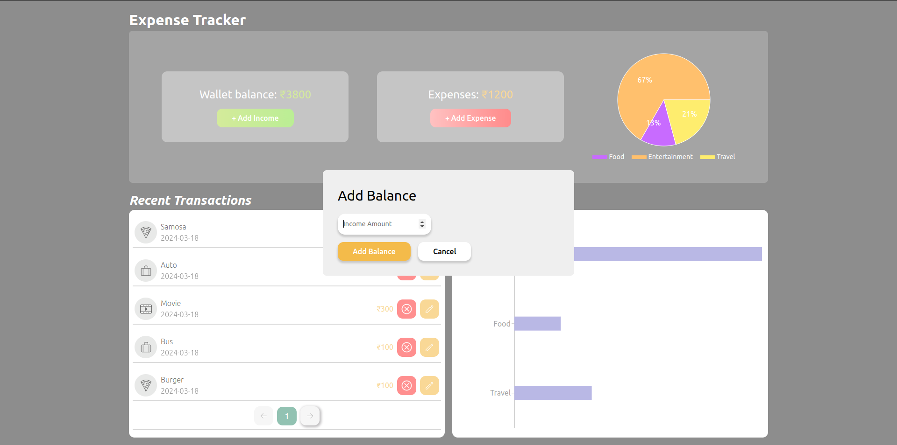

# Expense Tracker

A modern, responsive expense tracking app to help you manage your finances with ease.

## Features

- **Home Page:** Loads quickly and displays your wallet balance and expenses.
- **Wallet & Expenses Cards:** Instantly see your current balance and categorized expenses.
- **Header:** Clear, visible header with the app name.
- **Add Income Button:** Prominently placed and styled for easy access.
- **Responsive Design:** Works seamlessly on mobile and desktop.
- **Add Income/Expense:** Easily add new income or expenses.
- **Transaction List:** View all your transactions, categorized (Food, Travel, Entertainment, etc.).
- **Data Persistence:** All data is saved in your browser’s localStorage.

## Getting Started

1. **Clone the repository:**
   ```sh
   git clone https://github.com/YOUR-USERNAME/YOUR-REPO-NAME.git
   cd YOUR-REPO-NAME
   ```

2. **Install dependencies:**
   ```sh
   npm install
   ```

3. **Run the app:**
   ```sh
   npm run dev
   ```

## Screenshots




## License

MIT
